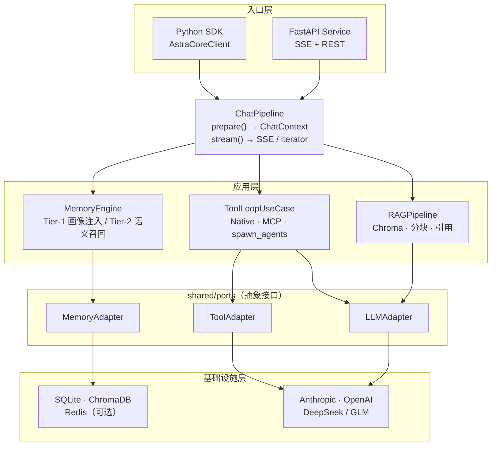

# AstraCoreAI


> 企业级 Python AI Agent 框架，基于 Clean Architecture + Ports & Adapters。

AstraCoreAI 为 LLM 应用提供完整的生产级基础设施：按需加载的 Skill 系统、两级记忆注入、HITL 审批流、并行多 Agent 与 DAG 工作流，以及覆盖可观测性、安全与评估的完整工具链。同一套业务逻辑可通过 Python SDK 嵌入，或以 FastAPI 服务独立部署。

---

## 核心能力

### Skill 系统

Claude 通过 `load_skill` 工具按需加载专业能力包（SKILL.md 格式），兼容 Agent Skills 开放标准。三层 System Prompt（身份层 + Skill 摘要清单 + 动态上下文）保证路由准确且可审计。

### 两级记忆（Tier-1 / Tier-2）

| 层级 | 作用域 | 注入方式 |
|------|--------|---------|
| Tier-1 | user / global | 全量写入 System Prompt（画像 / 规范 / 偏好） |
| Tier-2 | session / project | 向量语义检索，以合成消息对注入对话历史 |

每轮结束后 LLM 批量提取结构化记忆，高价值条目经启发式过滤 + LLM 判断后自动晋升作用域。Chroma 不可用时降级到 SQL 检索，系统不中断。

### HITL（Human-in-the-Loop）

工具执行审批、记忆晋升审批、`ask_user` 主动询问，三类交互均可通过配置独立开关。

### 工具系统

- Native Python 工具：并行 / 串行执行，JSON 自修复，单次超时隔离
- MCP 工具：内置 filesystem（10 个工具）和 shell server，支持任意自定义 MCP 进程
- 工具循环健壮性：悬空 `tool_use` 清理、空响应引导、总结收尾兜底

### 多 Agent 与 DAG 工作流

- `spawn_agents`：2–5 个 Worker 并发，前端实时折叠展示
- `NativeWorkflowOrchestrator`：Kahn 拓扑排序 + 层级 `asyncio.gather`，支持 `depends_on` 依赖声明与 `condition` 条件跳过

### 可观测性

| 组件 | 功能 |
|------|------|
| HookRegistry | `before/after_llm/tool` 四切入点，支持 ShortCircuit 短路 |
| Tracer | Span 链路追踪，结构化 JSON 写入 DEBUG 日志，无 OTel 依赖 |
| CircuitBreaker | 三态状态机，fast-fail + 探测恢复 |
| PolicyEngine | tenacity retry + asyncio timeout，Token 预算 O(n) 截断 |

### 安全

- Prompt 注入防御：外部数据以 `<external_data trust="untrusted">` 包裹，System Prompt 含显式注入声明
- JWT 认证：register / login，admin / user 双角色，首个用户自动为管理员
- SecurityValidator：XSS 检测、输入长度限制、敏感字段脱敏

### 其他能力

- **HistoryCompactor**：context_window 50% 触发，LLM 摘要 + MemoryEngine 持久化
- **RAG**：ChromaDB 向量检索，幂等 upsert，引用支持
- **Eval 框架**：EvalRunner，LLM-as-judge，工具精确匹配，CLI（`python -m astracore.eval`）
- **Structured Output**：`LLMAdapter.generate(response_format=MyModel)` 强制结构化输出
- **多 LLM Profile**：Anthropic Claude、OpenAI 兼容（DeepSeek / GLM），通过 profile ID 切换

---

## 架构



`ChatPipeline.prepare()` 一次性完成所有 DB 查询，返回不可变 `ChatContext`；`stream()` 纯执行，无分支歧义。SDK 与 HTTP Service 共享同一管道，行为完全一致。

---

## 快速开始

### 前置条件

- Python 3.11+
- [Hatch](https://hatch.pypa.io/)（`pip install hatch`）
- Anthropic API Key（或其他兼容 provider）

### 安装与配置

```bash
# 1. 克隆项目
git clone https://github.com/your-org/AstraCoreAI.git
cd AstraCoreAI

# 2. 初始化环境（hatch + 所有依赖）
make setup

# 3. 复制配置文件
cp config/config.example.yaml config/config.yaml

# 4. 写入密钥（仅放 secrets，结构配置在 config.yaml）
echo "ANTHROPIC_API_KEY=sk-ant-xxx" > .env

# 5. 验证环境
make test
```

### SDK 示例

```python
import asyncio
from astracore.sdk import AstraCoreClient

async def main():
    async with AstraCoreClient() as client:
        conv = client.conversation(use_tools=True, model_profile="claude-sonnet")

        # 单次对话
        result = await conv.send("你好，介绍一下自己")
        print(result.content)

        # 流式对话（同一会话自动续接）
        async for chunk in conv.stream("讲一个短故事"):
            print(chunk, end="", flush=True)

asyncio.run(main())
```

恢复已有会话：`client.conversation(session_id=existing_uuid)`

### 启动服务

```bash
make api        # 后端 http://127.0.0.1:8000  (Swagger: /docs)
make fe-dev     # 前端 http://127.0.0.1:5173
```

HTTP 聊天采用后台 Run 模型：`POST /api/v1/chat/runs` 创建任务，`GET /api/v1/chat/runs/{run_id}/stream` 订阅 SSE。页面刷新不中断生成，重连后自动恢复。

---

## 内置 Skill

Skill 文件位于 `src/astracore/modules/skills/builtin/`，Claude 通过 `load_skill` 自主路由。

| Skill ID | 说明 |
|----------|------|
| 按目录扫描自动注册 | 支持 `skills.extra_dirs` 扩展外部目录 |

新增 Skill 只需在目录下放置符合 SKILL.md 格式的文件，重启后自动可用。

---

## 内置工具

| 工具 | 类型 | 说明 |
|------|------|------|
| `filesystem` MCP | MCP | read / write / edit / search 等 10 个文件操作工具 |
| `shell` MCP | MCP | 受控命令执行，需配置 `allow_dirs` |
| `load_skill` | Native | 按需加载 Skill 能力包 |
| `get_skill_reference` | Native | 按需拉取 Skill 参考文档 |
| `run_skill_script` | Native | 执行 Skill 附带的脚本 |
| `spawn_agents` | Native | 启动并行子 Agent（2–5 个） |
| `ask_user` | Native | HITL 主动询问用户 |

---

## 配置参考

`config/config.yaml` 管理所有结构化配置，`.env` 仅放密钥。

```yaml
llm:
  default_profile: claude-sonnet
  profiles:
    - id: claude-sonnet
      label: Claude Sonnet
      protocol: anthropic
      base_url: https://api.anthropic.com
      api_key_env: ANTHROPIC_API_KEY
      model: claude-sonnet-4-6
    # 添加 OpenAI 兼容 provider：
    # - id: deepseek
    #   protocol: openai
    #   base_url: https://api.deepseek.com
    #   api_key_env: DEEPSEEK_API_KEY
    #   model: deepseek-chat

agent:
  max_tool_result_chars: 20000   # 单次工具返回最大字符数
  max_tool_iterations: 10        # 工具调用最大轮次（0 = 不限）
  tool_timeout_s: 120            # 单次工具超时（秒）
  enable_spawn_agents: true      # 是否暴露 spawn_agents 工具

retrieval:
  collection_name: astracore
  persist_directory: ./chroma_db
  # embedding_model: paraphrase-multilingual-MiniLM-L12-v2  # 中文场景

mcp:
  servers:
    - type: filesystem
      paths:
        - /path/to/project
    - type: shell
      allow_dirs:
        - /path/to/project
    # 自定义 MCP 进程：
    # - type: custom
    #   name: my-server
    #   command: node
    #   args: [./my-mcp-server.js]

skills:
  extra_dirs: []   # 额外 Skill 目录（绝对路径或 ~/xxx）
```

```bash
# .env（仅密钥）
ANTHROPIC_API_KEY=sk-ant-xxx
TAVILY_API_KEY=tvly-xxx
```

### MCP 服务器类型

| type | 必填字段 | 说明 |
|------|---------|------|
| `filesystem` | `paths: list[str]` | 内置 Python 实现，无需 Node.js |
| `shell` | `allow_dirs: list[str]` | 受控命令执行 |
| `custom` | `name`, `command`, `args` | 任意外部 MCP 进程 |

---

## 开发命令

| 命令 | 说明 |
|------|------|
| `make setup` | 一键初始化 hatch 环境 + 依赖 |
| `make api` | 启动后端服务（:8000） |
| `make fe-dev` | 启动前端开发服务器（:5173） |
| `make test` | 运行 pytest |
| `make test-cov` | 运行测试并生成覆盖率报告 |
| `make lint` | ruff check |
| `make type-check` | mypy |
| `make check` | lint + type-check（提交前必跑） |
| `make fmt` | ruff format |
| `make clean` | 清理缓存 |
| `make clean-rag` | 清空 ChromaDB 数据 |

单测：`hatch run pytest tests/path/to/test_file.py::TestClass::test_method -v`

---

## 示例

示例均通过 SDK 直接运行，无需先启动 HTTP 服务：

| 文件 | 内容 |
|------|------|
| `examples/basic_chat.py` | 同步 / 流式对话、会话续接 |
| `examples/tool_calling.py` | 工具事件流、自定义工具注册 |
| `examples/rag_example.py` | 文档索引、向量检索、RAG 增强对话 |
| `examples/memory_example.py` | 手动 CRUD、Project 绑定、自动记忆提取 |
| `examples/multi_agent.py` | asyncio.gather 并发多会话 |
| `examples/skill_with_tools.py` | Skill 绑定与工具联动 |
| `examples/run_service.py` | 启动 FastAPI HTTP 服务 |

### DAG 工作流

```python
from astracore.sdk import AstraCoreClient
from astracore.modules.agent.domain import AgentTask, AgentRole

async with AstraCoreClient() as client:
    t1 = AgentTask(role=AgentRole.EXECUTOR, description="搜索 Python asyncio 最佳实践")
    t2 = AgentTask(
        role=AgentRole.EXECUTOR,
        description="基于搜索结果，写一份 500 字技术总结",
        depends_on=[t1.task_id],
    )
    t3 = AgentTask(
        role=AgentRole.REVIEWER,
        description="审校总结，给出改进意见",
        depends_on=[t2.task_id],
        condition="len(task_results) >= 2",
    )
    state = await client.workflow.run("asyncio-research", [t1, t2, t3], use_tools=True)
    print(state.task_results)
```

### Hook + Tracing

```python
from astracore.sdk import AstraCoreClient
from astracore.shared.observability.hooks import HookRegistry
from astracore.shared.observability.tracing import Tracer

registry = HookRegistry()
registry.before_llm.append(lambda p: print(f"[llm] messages={len(p.messages)}"))

tracer = Tracer(session_id="my-session")
tracer.register_hooks(registry)

async with AstraCoreClient(hooks=registry) as client:
    result = await client.chat("你好")
    print(result.content)
```

---

## 路线图

- [x] M1–M5+：核心闭环（LLM / 工具 / 记忆 / RAG / Skill / 多 Agent / DAG / Hook / Eval / JWT 认证）
- [x] M6 认证：JWT auth 完成
- [ ] M6 剩余：限流、多 worker Redis 状态共享
- [ ] M7：OpenTelemetry 标准 tracing、SLO / 指标
- [ ] M8：发布工程化（版本策略、回滚预案、运维文档）

---

## 文档

| 文档 | 路径 |
|------|------|
| 系统设计文档 | `docs/AstraCoreAI设计文档.md` |
| 开发进度规划 | `docs/开发进度规划.md` |
| 专业度评估与优化路线 | `docs/专业度评估与优化路线.md` |
| 前端设计方案 | `docs/前端设计方案.md` |
| 子系统设计方案 | `docs/子系统设计方案.md` |
| 工具循环踩坑记录 | `docs/工具循环踩坑记录.md` |
| 贡献指南 | `docs/CONTRIBUTING.md` |

---

## 许可证

AstraCoreAI 使用 [PolyForm Noncommercial License 1.0.0](./LICENSE)。
个人学习、研究和非商业用途按许可证条款使用；商业授权请查看 [COMMERCIAL.md](./COMMERCIAL.md)。
