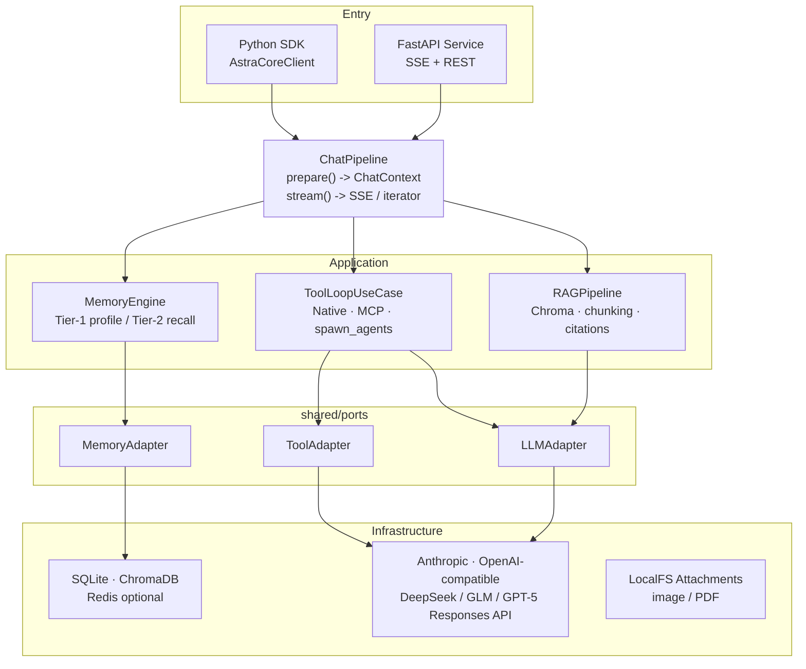

# AstraCoreAI


> Enterprise-grade Python AI agent framework built with Clean Architecture and Ports & Adapters.

AstraCoreAI provides production-ready infrastructure for LLM applications: on-demand Skills, tiered memory, Human-in-the-Loop approvals, native and MCP tools, scheduled tasks, parallel agents, DAG workflows, multi-modal attachments, observability, security hardening, and evaluation utilities. The same business logic runs through the Python SDK or as a standalone FastAPI service.

[中文 README](./README.zh-CN.md)

---

## Core Capabilities

### Skill System

AstraCoreAI lets the model load specialized capability packs through the `load_skill` tool. Built-in skills use the `SKILL.md` format and are compatible with the Agent Skills style of progressive disclosure: a concise manifest is injected into the system prompt, while full references are loaded only when needed.

### Tiered Memory

| Tier | Scope | Injection Method |
|------|-------|------------------|
| Tier 1 | `user` / `global` | Fully injected into the system prompt as profile, preference, and policy context |
| Tier 2 | `session` / `project` | Retrieved semantically and injected as synthetic turn context |

At the end of each turn, AstraCoreAI extracts structured memories in batches. Session memories can be compacted, searched, and promoted according to policy. If ChromaDB is unavailable, the memory engine falls back to SQL retrieval so the chat flow keeps running.

### Human-in-the-Loop

HITL support is built into the tool loop:

- Tool approvals for tools marked with `requires_confirmation=True`
- Memory promotion approvals
- Inline user questions through the native `ask_user` tool
- Configurable timeout and feature switches

### Tool System

- Native Python tools with schema validation, JSON repair, and timeout isolation
- Built-in MCP filesystem and shell integrations
- Custom MCP server support
- Robust tool-loop handling for dangling tool calls, empty responses, and final summaries
- Parallel sub-agent execution through `spawn_agents` when enabled

### Scheduled Tasks

AstraCoreAI includes an APScheduler-backed task system. Each task stores a prompt and runs through the same `ChatPipeline`, including tools, memory, RAG, and Skills.

| Trigger | Description | Example |
|---------|-------------|---------|
| `cron` | Standard crontab expression | `0 9 * * 1-5` |
| `interval` | Repeating fixed interval | Every 30 minutes |
| `date` | One-time scheduled run | Run once at a specific time |

Tasks can be paused, resumed, executed immediately, filtered, and inspected from the frontend.

### Multi-Agent and DAG Workflows

- `spawn_agents`: run 2 to 5 worker agents in parallel with streaming progress
- `NativeWorkflowOrchestrator`: executes dependency graphs with Kahn topological sorting and layer-level `asyncio.gather`
- Task dependencies through `depends_on`
- Conditional task skipping through `condition`

### Observability

| Component | Purpose |
|-----------|---------|
| `HookRegistry` | `before_llm`, `after_llm`, `before_tool`, and `after_tool` extension points |
| `Tracer` | Lightweight span tracing with structured JSON logs |
| `CircuitBreaker` | Three-state fast-fail and recovery probing |
| `PolicyEngine` | Tenacity retries, asyncio timeouts, and token-budget truncation |

### Security

- Prompt-injection defense through `<external_data trust="untrusted">` wrappers
- Explicit system prompt instructions for untrusted external content
- JWT authentication with `admin` and `user` roles
- First registered user becomes admin
- XSS and input-length checks through `SecurityValidator`
- Sensitive-field redaction in relevant paths

### Attachments

AstraCoreAI supports image and PDF attachments in conversations:

- Images are sent as native vision blocks (Anthropic) or `image_url` (OpenAI-compatible)
- PDFs are converted to text by pypdf and injected as content when native document blocks are not available
- Upload via `POST /api/v1/attachments`; reference by ID in `ChatOptions.attachments`
- The SDK `Conversation.send(attachments=[...])` accepts local `Path` objects or `AttachmentRef` IDs
- Upload is gated by `profile.capabilities.vision` — the frontend disables the button when the model does not support vision

### Model Controls

Each LLM profile exposes a `controls` list on the `/system` endpoint. The frontend renders controls dynamically based on `kind`:

| `kind` | Where | Shown when |
|--------|-------|------------|
| `thinking` | Main toolbar | `caps.thinking == True` |
| `reasoning_effort` | Main toolbar | `caps.reasoning_effort_protocol != None` |
| `temperature` | Advanced panel | `caps.temperature == True` |
| `top_p` | Advanced panel | `caps.temperature == True` |
| `top_k` | Advanced panel | `caps.top_k == True` (Anthropic native) |

Adding a new model only requires updating `infer_model_capabilities()` — no frontend code changes needed.

### Additional Features

- **HistoryCompactor**: summarizes old conversation history and persists the summary as session memory
- **RAG**: ChromaDB-backed retrieval with idempotent upsert and citations
- **TTS**: text-to-speech synthesis endpoint
- **Evaluation Framework**: LLM-as-judge, tool-call matching, and CLI execution through `python -m astracore.eval`
- **Structured Output**: `LLMAdapter.generate(response_format=MyModel)` for Pydantic-enforced outputs
- **LLM Profiles**: switch between Anthropic Claude, OpenAI-compatible providers (DeepSeek, GLM), OpenAI Responses API (GPT-5), and custom endpoints by profile ID

---

## Architecture



`ChatPipeline.prepare()` performs batched database reads and returns an immutable `ChatContext`. `stream()` then executes the turn through either the normal LLM path or the tool-loop path. SDK and HTTP modes share the same pipeline, so behavior stays consistent across embedding and service deployments.

---

## Quick Start

### Requirements

- Python 3.11+
- [Hatch](https://hatch.pypa.io/) (`pip install hatch`)
- An API key for Anthropic or another configured provider
- Node.js only if you plan to run the frontend or custom JavaScript MCP servers

### Install and Configure

```bash
git clone https://github.com/ayxworxfr/AstraCoreAI.git
cd AstraCoreAI

make setup
cp config/config.example.yaml config/config.yaml
cp .env.example .env
```

Put secrets in `.env` only:

```bash
ANTHROPIC_API_KEY=sk-ant-xxx
DEEPSEEK_API_KEY=sk-xxx
TAVILY_API_KEY=tvly-xxx
```

Then verify the environment:

```bash
make test
```

### Python SDK Example

```python
import asyncio

from astracore.sdk import AstraCoreClient


async def main() -> None:
    async with AstraCoreClient() as client:
        conversation = client.conversation(use_tools=True, model_profile="claude-sonnet")

        result = await conversation.send("Introduce yourself briefly.")
        print(result.content)

        async for chunk in conversation.stream("Tell me a short story."):
            print(chunk, end="", flush=True)


asyncio.run(main())
```

Resume an existing conversation with:

```python
client.conversation(session_id=existing_uuid)
```

### Start the Service

```bash
make api        # backend: http://127.0.0.1:8000  Swagger: /docs
make fe-install # first-time frontend dependency install
make fe-dev     # frontend: http://127.0.0.1:5173
```

HTTP chat uses a background run model:

- `POST /api/v1/chat/runs` creates a generation run
- `GET /api/v1/chat/runs/{run_id}/stream` subscribes to SSE

Browser refreshes do not cancel generation. The frontend can reconnect to the same `run_id`.

---

## Built-in Skills

Built-in skills live in:

```text
src/astracore/modules/skills/builtin/
```

The model routes to them through `load_skill`, then loads long references through `get_skill_reference` when needed. Additional skill directories can be configured with `skills.extra_dirs`.

To add a built-in skill, create a directory containing a valid `SKILL.md`, optional `references/`, and optional scripts. Restart the service to rescan skills.

---

## Built-in Tools

| Tool | Type | Description |
|------|------|-------------|
| `load_skill` | Native | Load a skill package on demand |
| `get_skill_reference` | Native | Load a referenced skill document |
| `run_skill_script` | Native | Execute a script bundled with a skill |
| `save_memory` | Native | Save a structured memory item |
| `recall_memory` | Native | Semantic search over memory |
| `compact_memory` | Native | Compact session memories into summaries |
| `ask_user` | Native | Ask the user a HITL question inline |
| `spawn_agents` | Native | Launch 2–5 parallel worker agents |
| `filesystem` | MCP | Controlled file operations (10 tools) |
| `shell` | MCP | Controlled shell command execution |

---

## Frontend Modules

| Page | Features |
|------|----------|
| Chat | SSE streaming, conversation management, tool activity, HITL approvals, image/PDF attachments, model controls toolbar |
| Memory | CRUD, batch delete, scope filters, promotion approval queue |
| Scheduling | cron / interval / date tasks, pause, resume, run now, search, batch delete |
| Skills | Skill CRUD and `SKILL.md` editing |
| Knowledge Base | Document upload and retrieval debugging |
| Settings | User profile, assistant identity, global instructions |
| System | LLM profile capabilities, MCP servers, RAG status |
| TTS | Text-to-speech synthesis |

---

## Configuration

`config/config.yaml` contains structured configuration. `.env` contains secrets only. In normal use, you should copy `config/config.example.yaml` and edit provider, storage, and feature switches instead of writing the whole schema by hand. The canonical schema is `AstraCoreConfig` in `src/astracore/sdk/config.py`.

Configuration is organized around a few stable sections:

- `llm`: selectable model profiles and the default profile.
- `storage`: SQLite, Redis, and vector-store configuration; RAG vector settings live under `storage.vector`.
- `policy`: retry, timeout, and history-compaction policy.
- `hitl` / `agent` / `scheduling`: user approvals, tool-loop behavior, multi-agent execution, and scheduled tasks.
- `mcp`: built-in and custom MCP servers.

```yaml
llm:
  default_profile: claude-sonnet
  profiles:
    - id: claude-sonnet
      label: Claude Sonnet
      protocol: anthropic
      base_url: https://api.anthropic.com
      api_key_env: ANTHROPIC_API_KEY
      model: claude-sonnet-4-6
      max_tokens: 8192

policy:
  timeout:
    llm_timeout_s: 180
    tool_timeout_s: 120
  compaction:
    context_window_tokens: 200000
    trigger_ratio: 0.5

agent:
  max_tool_result_chars: 20000
  max_tool_iterations: 10
  enable_spawn_agents: true

hitl:
  enabled: true
  inline_question_timeout: 300
  require_tool_approval: true
  require_memory_promotion_approval: true

auth:
  secret_key: change-me-in-production
  token_expire_days: 30
  allow_registration: true

storage:
  db_url: sqlite+aiosqlite:///./astracore.db
  redis_url: redis://localhost:6379/0
  vector:
    enabled: true
    collection_name: astracore
    persist_directory: ./chroma_db
    embedding_model: all-MiniLM-L6-v2

skills:
  extra_dirs: []

scheduling:
  enabled: true
  default_timezone: Asia/Shanghai

mcp:
  servers:
    - type: filesystem
      paths:
        - /path/to/project

    - type: shell
      allow_dirs:
        - /path/to/project
      timeout: 30
```

See `config/config.example.yaml` for the full template. Use it when configuring DeepSeek, GLM, GPT Responses API, thinking/reasoning controls, attachment storage path, profile-level timeout/retry overrides, or custom MCP processes.

| MCP Type | Required Fields | Description |
|----------|-----------------|-------------|
| `filesystem` | `paths` | Built-in Python filesystem MCP server |
| `shell` | `allow_dirs` | Controlled shell execution |
| `custom` | `name`, `command`, `args` | External MCP process |

---

## Development Commands

| Command | Description |
|---------|-------------|
| `make setup` | Initialize Hatch and install dependencies |
| `make api` | Start the backend service on port 8000 |
| `make fe-install` | Install frontend dependencies |
| `make fe-dev` | Start the Vite frontend on port 5173 |
| `make test` | Run pytest |
| `make test-cov` | Run pytest with coverage |
| `make lint` | Run Ruff |
| `make type-check` | Run mypy |
| `make check` | Run lint and type-check |
| `make fmt` | Format Python code with Ruff |
| `make clean` | Remove caches |
| `make clean-rag` | Clear ChromaDB data |

Run a single test:

```bash
hatch run pytest tests/path/to/test_file.py::TestClass::test_method -v
```

---

## Examples

Examples run through the SDK and do not require the HTTP service:

| File | Description |
|------|-------------|
| `examples/basic_chat.py` | Basic and streaming chat |
| `examples/tool_calling.py` | Tool event stream and custom tool registration |
| `examples/rag_example.py` | Document indexing, retrieval, and RAG chat |
| `examples/memory_example.py` | Memory CRUD, project binding, and extraction |
| `examples/multi_agent.py` | Concurrent multi-conversation execution |
| `examples/skill_with_tools.py` | Skill routing and tool usage |
| `examples/run_service.py` | Start the FastAPI service |

### DAG Workflow Example

```python
from astracore.modules.agent.domain import AgentRole, AgentTask
from astracore.sdk import AstraCoreClient

async with AstraCoreClient() as client:
    research = AgentTask(
        role=AgentRole.EXECUTOR,
        description="Research Python asyncio best practices.",
    )
    writeup = AgentTask(
        role=AgentRole.EXECUTOR,
        description="Write a concise technical summary from the research.",
        depends_on=[research.task_id],
    )
    review = AgentTask(
        role=AgentRole.REVIEWER,
        description="Review the summary and suggest improvements.",
        depends_on=[writeup.task_id],
        condition="len(task_results) >= 2",
    )

    state = await client.workflow.run(
        "asyncio-research",
        [research, writeup, review],
        use_tools=True,
    )
    print(state.task_results)
```

### Hook and Tracing Example

```python
from astracore.sdk import AstraCoreClient
from astracore.shared.observability.hooks import HookRegistry
from astracore.shared.observability.tracing import Tracer

registry = HookRegistry()
registry.before_llm.append(lambda payload: print(f"[llm] messages={len(payload.messages)}"))

tracer = Tracer(session_id="my-session")
tracer.register_hooks(registry)

async with AstraCoreClient(hooks=registry) as client:
    result = await client.chat("Hello")
    print(result.content)
```

---

## Documentation

| Document | Path |
|----------|------|
| Chinese README | [`README.zh-CN.md`](./README.zh-CN.md) |
| System design | `docs/AstraCoreAI设计文档.md` |
| Development roadmap | `docs/开发进度规划.md` |
| Frontend design | `docs/前端设计方案.md` |
| Subsystem design | `docs/子系统设计方案.md` |
| Engineering assessment | `docs/专业度评估与优化路线.md` |
| System prompt design | `docs/系统提示词设计.md` |
| Contributing guide | `docs/CONTRIBUTING.md` |

---

## Roadmap

- [x] Core LLM, tool, memory, RAG, Skill, multi-agent, DAG, hook, eval, and JWT authentication loop
- [x] Scheduled tasks
- [x] HITL tool approval and memory promotion flow
- [x] Image and PDF attachment support (vision + document blocks)
- [x] Dynamic model controls descriptor (`controls` list per profile)
- [x] Multi-provider LLM support: Anthropic, OpenAI Responses API (GPT-5), OpenAI Chat Completions (DeepSeek, GLM), custom endpoints
- [x] TTS synthesis
- [ ] Rate limiting
- [ ] Redis-backed multi-worker run state
- [ ] OpenTelemetry-compatible tracing, SLOs, and metrics
- [ ] Release engineering, rollback playbooks, and operational documentation

---

## License

AstraCoreAI is licensed under the [PolyForm Noncommercial License 1.0.0](./LICENSE).

Personal learning, research, and other non-commercial usage are allowed under the license terms. For commercial use, see [COMMERCIAL.md](./COMMERCIAL.md).
