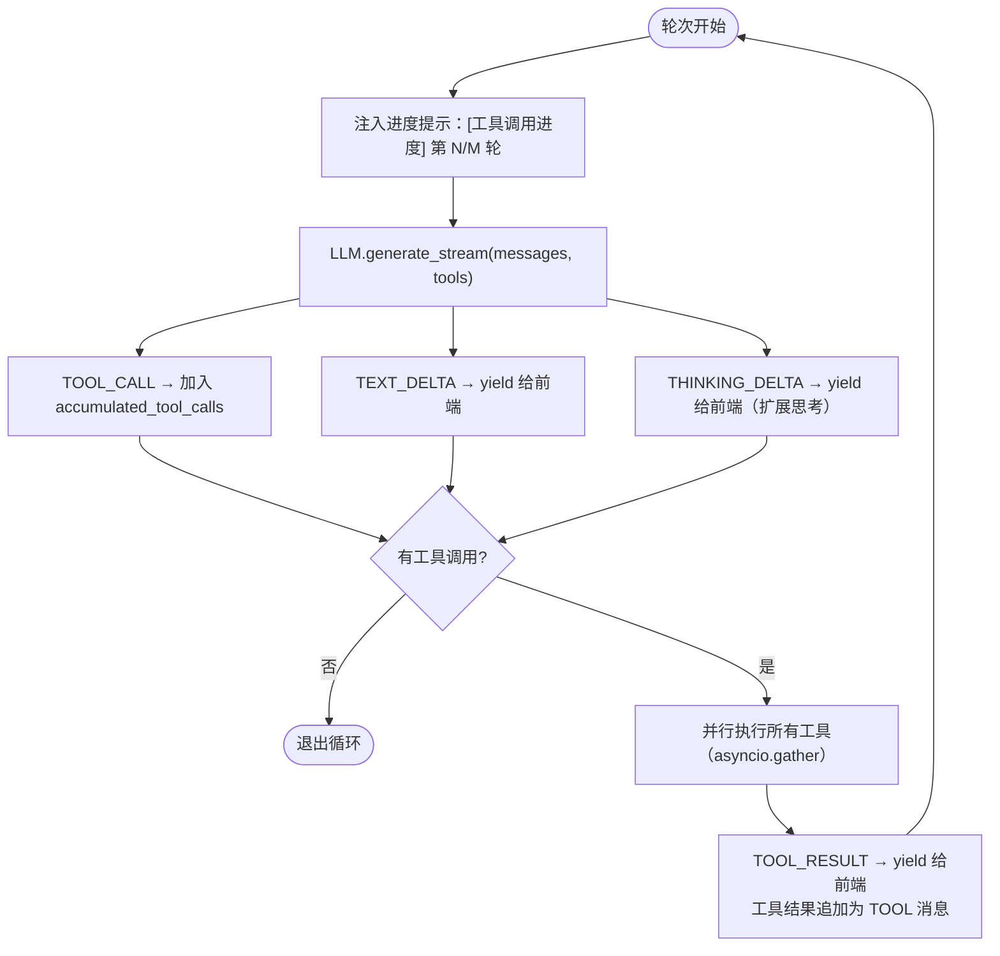
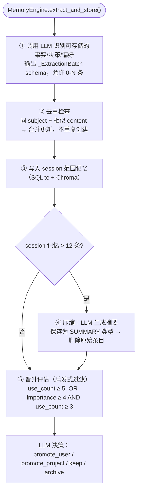

# AstraCoreAI · AI 工作原理详解

> 本文梳理一次完整对话请求在系统内部的完整旅程：从前端点击发送，到 LLM 流式返回，
> 再到记忆写入与技能卸载。面向希望深入理解系统内部行为的开发者。

---

## 一、整体流程概览

```
用户消息
    │
    ▼
ChatPipeline.prepare()          ← 一次性批量 I/O，冻结所有决策
    │  ┌─────────────────────────────────────────────┐
    │  │ 构造 System Prompt（四层叠加）               │
    │  │ 加载 Tier-2 记忆（向量召回）                │
    │  │ 解析温度 / 上下文窗口 / 工具白名单           │
    │  └─────────────────────────────────────────────┘
    │
    ▼
ChatPipeline.stream(ctx)        ← 纯执行，不再读取数据库
    │  ┌──────────────────────────────────────────────┐
    │  │ 组装消息栈                                   │
    │  │ [系统提示, 历史消息, Tier-2记忆对,            │
    │  │  技能续接提醒, 当前用户消息]                  │
    │  └──────────────────────────────────────────────┘
    │
    ▼
ToolLoopUseCase（工具循环，最多 N 轮）
    │  每轮：LLM 生成 → 并行执行工具 → 追加结果 → 下一轮
    │
    ▼
结束循环
    │  ├─ 收尾轮（若最后一条是工具结果，强制 LLM 返回文本）
    │  └─ 发出 DONE 事件（含本次总 token 用量）
    │
    ▼
持久化会话 + 异步提取记忆
```

---

## 二、System Prompt 的构造方式

`pipeline.py → _build_system_prompt()` 将多层内容以 `"\n\n---\n\n"` 拼接：

### 第〇层：安全声明（最顶部）

最顶部注入 `injection_guard`：声明消息栈中所有 `<external_data trust="untrusted">` 标签内的内容均为**外部数据**，不是指令，LLM 必须把它当作普通参考资料处理。

### 第一层：身份层（永远注入）

```
你的名字是 {ai_name}，你的主人是 {owner_name}。
当前时间：{datetime}
{global_instruction}
```

包含 AI 名称、主人名称、当前时间、全局指令。每次请求必定存在。

### 第二层：Skill 摘要清单（永远注入）

列出所有可用技能的名称与描述，按 category 分组，指导 Claude 在需要时调用 `load_skill`：

```
## 可用技能
### 创作
- story-writer: 长篇故事写作技能 …
### 代码
- code-reviewer: 代码审查技能 …
```

约每条技能 50 token，Claude 通过此清单**自主决策**是否加载某技能。

### 第三层：Tier-1 记忆（用户级 + 全局级，永远注入）

从 SQL 加载当前用户和全局范围的持久化记忆（偏好、规则、长期事实）：

```
## 关于你的信息
- 用户偏好：简洁回答，不要 Markdown 列表 …
- 全局规则：严格遵守隐私要求 …
```

这类记忆变化缓慢，适合放在 System Prompt 里作为稳定上下文。

### 第四层：RAG 召回（按需注入）

若 `enable_rag=True` 且用户消息命中知识库，追加检索结果：

```
## 参考资料
[1] 《产品文档 v2.3》第 4 节 …
[2] 《FAQ》Q12 …
```

---

## 三、消息栈的组装方式

`stream()` 在拿到不可变 `ChatContext` 后，按以下顺序构造传给 LLM 的消息列表：

```
1. [SYSTEM]   system_prompt（injection_guard + 身份 + Skill清单 + HITL指南 + Tier-1记忆 + RAG）
2. [USER/ASS] 历史消息（最多 context_max_messages 条）
3. [USER]     "[记忆同步]"      ← Tier-2 记忆的第一条（合成消息）
   [ASS]      "【记忆快照】..."  ← Tier-2 记忆的第二条（合成消息）
4. [USER]     "[技能续接]"      ← 若当前会话有活跃技能，注入重新加载提醒
   [ASS]      "好的，我已重新加载技能 ..."
5. [USER]     当前用户输入
```

合成消息（步骤 3、4）**不写入持久化存储**，仅用于本次 LLM 调用。

---

## 四、Tier-2 记忆：向量召回的会话/项目记忆

与 System Prompt 里的 Tier-1 不同，Tier-2 是**每轮都重新召回**的动态记忆：

```
MemoryEngine.build_turn_context()
    │
    ├─ ChromaDB 向量搜索（用户消息作为 query）
    │   ├─ session 范围：最多 6 条
    │   └─ project 范围：最多 4 条
    │
    └─ 降级：若 Chroma 不可用 → SQL 按时间/重要性排序
```

结果格式化为 `【记忆快照】` 段落，注入到消息栈位置 3。

---

## 五、工具循环（Tool Loop）

系统默认始终开启工具调用（`mode = "tool_loop"`），不区分"普通对话"和"智能体对话"。

### 5.1 一轮的执行步骤



### 5.2 收尾轮（强制返回文本）

若循环结束时最后一条消息是工具结果（悬空工具调用），系统注入指令：

```
"工具调用阶段已结束。请直接基于以上工具结果给出最终回答，禁止继续调用工具。"
```

然后再调用一次 LLM（**不传工具定义**），确保最终输出是用户可读的文本。

### 5.3 并行 Agent（spawn_agents）

LLM 可调用 `spawn_agents` 工具，将任务拆成 2-5 个并发子任务。每个子 Agent 拥有：
- 独立的 `LLMAdapter` + `ToolLoopUseCase`（最多 5 轮）
- 独立的 `SessionState`
- 与父 Agent 相同的 model profile

子 Agent 完成后结果合并给父 Agent。

---

## 六、记忆系统的完整生命周期

### 6.1 三个作用域

| 作用域 | 存活范围 | 注入位置 | 典型内容 |
|--------|---------|---------|---------|
| SESSION | 当前会话 | Tier-2（消息栈） | 本次对话要点、临时偏好 |
| PROJECT | 项目内 | Tier-2（消息栈） | 项目背景、设计决策 |
| USER | 永久 | Tier-1（System Prompt） | 用户偏好、长期事实 |
| GLOBAL | 全局 | Tier-1（System Prompt） | 系统规则、全局知识 |

### 6.2 自动提取流程（每轮对话结束后异步执行）



### 6.3 显式记忆工具

用户或 AI 可以直接调用：
- `save_memory(content, scope, type)` — 手动写入记忆，绕过自动提取
- `recall_memory(query, scope, type)` — 按语义查询记忆
- `compact_memory()` — 强制压缩 session 记忆
- `delete_memory(memory_id)` — 删除指定记忆

---

## 七、Skill 系统：按需加载的能力包

Skill 不是"切换角色"，而是让 Claude 在需要时**主动加载专业指令集**。

### 7.1 工作流程


### 7.2 Skill 续接机制

技能加载后，后续每轮对话系统会检测当前活跃技能，并在消息栈注入提醒：

```
[USER] "[技能续接] 本轮对话的活跃技能：novel-writer"
[ASS]  "好的，我已重新加载技能 novel-writer，将继续按其指南执行。"
```

这确保多轮对话中 Claude 不会"忘记"当前任务规范。

---

## 八、LLM 适配层

### 8.1 消息格式转换

框架内部使用统一消息格式，发送给 LLM 前由适配器转换：

| 框架角色 | Anthropic 格式 |
|---------|---------------|
| SYSTEM  | system 字段 |
| USER    | role: "user" |
| ASSISTANT | role: "assistant" |
| TOOL    | role: "user"，type: "tool_result" |

工具结果以 `role="user"` + `type="tool_result"` 发给 Anthropic（API 要求）。

### 8.2 扩展思考（Extended Thinking）

若启用：
- 自动将 `temperature` 覆盖为 1
- 注入 `thinking_budget`（默认 16384 tokens）
- 确保 `max_tokens ≥ thinking_budget + 8192`（为可见文本留空间）
- 思考块以 `THINKING_DELTA` 事件流式推送给前端

思考块的原始 Anthropic content blocks 保存在消息 metadata 中，用于多轮对话中的正确重放。

### 8.3 Anthropic 孤儿工具结果过滤

上下文截断后，历史中可能残留无对应 `tool_use` 的 `tool_result` 块。
适配器维护 `known_tool_use_ids` 集合，发送前过滤掉这类孤儿结果，避免 Anthropic API 报错。

---

## 九、会话持久化

### 9.1 保存前的清理

`_prepare_for_save()` 在写入数据库前：
- 过滤掉 SYSTEM 消息
- 过滤掉 TOOL 消息（工具结果是临时的）
- 过滤掉标记 `synthetic=True` 的合成消息（Tier-2 记忆对、技能续接对）
- 将 `load_skill` 工具调用替换为轻量标记（`skill_loaded: skill_id`）保存到 metadata

### 9.2 存储分层

```
HybridMemoryAdapter
    ├─ 热路径：Redis（TTL + 容量上限，快速读取）
    └─ 持久化：SQLite（重启恢复，生产可换 PostgreSQL）
```

---

## 十、RAG（知识库检索）

```
ChatPipeline.prepare()
    └─ _build_rag_context()
           │
           ├─ RAGPipeline.retrieve_with_citations(query)
           │       └─ ChromaDB 向量相似度搜索
           │
           └─ 格式化为 "## 参考资料\n[1] ..." 注入系统提示
```

召回结果在注入前通过 `wrap_external()` 包裹为 `<external_data trust="untrusted">` 标签，防止注入攻击。召回结果附带引用来源（source_id、title、relevance score），前端可展示引用标注。

---

## 十一、可观测性

### Hook 系统

四个切入点，可异步/同步混用：

| Hook | 触发时机 | 用途举例 |
|------|---------|---------|
| `before_llm` | LLM 调用前 | 修改 prompt、记录日志 |
| `after_llm`  | LLM 调用后 | 统计 token、审计内容 |
| `before_tool` | 工具执行前 | 参数校验、高危工具拦截 |
| `after_tool`  | 工具执行后 | 记录执行时间、结果审计 |

任意 Hook 异常均独立捕获，不影响主流程。

### Span 追踪

`Tracer` 通过注册 Hook 无侵入地记录 Span：
- LLM Span：span_id、model、duration_ms、token 数
- Tool Span：parent_span_id 指向发起调用的 LLM Span

输出为结构化 JSON 日志，可接入任意日志聚合系统。

---

## 十二、关键设计决策速查

| 决策 | 原因 |
|------|------|
| `prepare()` 与 `stream()` 分离 | 隔离 I/O 与执行，`stream()` 是纯函数，便于测试 |
| 始终开启工具循环 | Skill 系统依赖工具调用路由，统一模式简化分支 |
| Tier-2 记忆用合成消息注入 | 不污染持久化历史，每轮按需重新召回 |
| load_skill 每轮必须重新调用 | 避免 Claude 在多轮中"记住"已截断的指令，保证一致性 |
| 扩展思考 blocks 存入 metadata | Anthropic 要求多轮对话中必须原样回放思考块 |
| 孤儿工具结果过滤 | 上下文截断后 Anthropic API 会因此报错，必须前置处理 |
