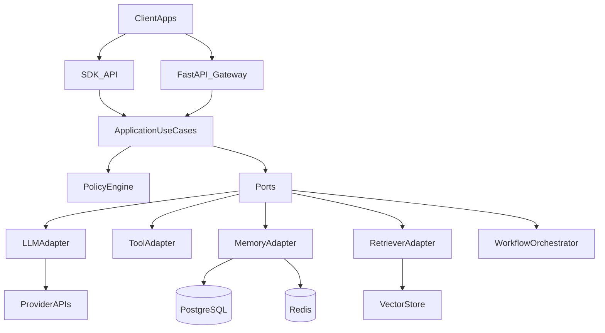
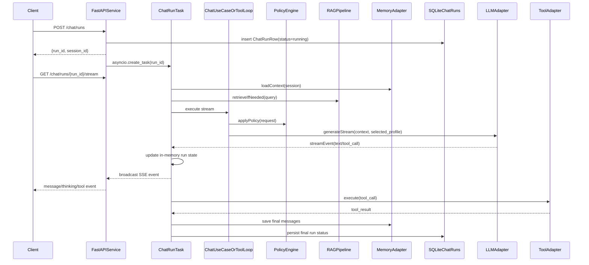

# Python AI Framework 设计文档

## 1. 背景与目标

本设计文档定义一套面向团队复用的 Python AI 框架，采用 `Clean Architecture + 自研轻内核` 路线，目标是：

- 让不同业务团队可以快速接入并复用统一 AI 能力
- 保持框架核心稳定，避免被具体 Provider 或编排框架绑定
- 同时提供 SDK 形态与可运行服务骨架（FastAPI）
- 一次性覆盖 full stack 能力：核心对话、多模型 Profile、工具调用、记忆、RAG、多 Agent

非目标（当前阶段不做）：

- 不强依赖消息队列（默认最小依赖为 PostgreSQL + Redis）
- 不将 LangGraph 设为默认强依赖，只预留无缝接入能力

## 2. 设计原则

- **框架先于业务**：所有能力以可复用接口暴露，业务仅做配置与扩展
- **端口优先**：先定义协议与边界，再接入实现
- **策略集中治理**：预算、裁剪、超时、重试、审计统一进入策略层
- **双形态一致**：SDK 与 Service Skeleton 共享同一应用层能力
- **可演进编排**：默认 Native Orchestrator，后续可插 LangGraph Orchestrator

## 3. 总体架构



## 4. 分层与职责

### 4.1 Domain 层

负责纯领域模型与规则，不依赖 FastAPI、数据库驱动、第三方 SDK。

- 消息模型：`Message`, `MessageRole`, `ToolCall`, `ToolResult`
- 会话模型：`SessionState`, `ContextWindow`, `TokenBudget`
- 检索模型：`RetrievalQuery`, `RetrievedChunk`, `Citation`
- Agent 模型：`AgentTask`, `AgentRole`, `AgentDecision`

### 4.2 Application 层

负责业务用例编排，是框架核心行为所在。

- `ChatUseCase`：对话入口、流式输出、调用策略引擎
- `ChatRun`：Service 层后台生成任务，解耦浏览器 SSE 连接与实际 LLM 生成生命周期
- `ToolLoopUseCase`：工具调用循环、失败恢复、回写上下文
- `MemoryPipeline`：短期记忆与长期记忆融合
- `RAGPipeline`：召回、重排、引用拼接
- `AgentOrchestrationUseCase`：多 Agent 分工、协作、审批断点

### 4.3 Ports 层

定义可替换边界，保证实现可插拔。

- `LLMAdapter`
- `ToolAdapter`
- `MemoryAdapter`
- `RetrieverAdapter`
- `WorkflowOrchestrator`
- `AuditLogger`
- `MetricsReporter`

### 4.4 Infrastructure 层

对外部依赖的实现层。

- Provider：Claude / OpenAI 兼容协议适配，按模型 Profile 动态选择
- 存储：PostgreSQL（持久化）+ Redis（短期上下文与缓存）
- 检索：向量库适配（支持后续替换）
- 接口：FastAPI 网关、后台 Chat Run、SSE 订阅输出、鉴权与限流中间件
- 可观测：日志、指标、Trace

### 4.5 Interfaces 层

- SDK 接口：供业务代码直接嵌入调用
- HTTP 接口：供前端和外部系统使用
- 两者共享同一个 Application 层能力

## 5. 关键模块设计

### 5.1 Policy Engine（统一策略层）

统一治理下列策略，避免散落在各适配器中：

- Token 预算分配（输入、输出、工具、记忆）
- 上下文裁剪（最近窗口 + 摘要）
- 超时、重试、退避、熔断
- 调用降级（例如从复杂模型降级到经济模型）
- 安全策略（工具白名单、字段脱敏）

### 5.2 Chat Run 后台生成

Service 层将一次前端对话发送抽象为 `ChatRunRow`，避免浏览器连接成为生成任务的生命周期边界。

- **创建任务**：`POST /api/v1/chat/runs` 写入 `chat_runs`，并在后端进程内启动 asyncio 后台任务。
- **订阅输出**：`GET /api/v1/chat/runs/{run_id}/stream` 只订阅当前 run 的事件流；连接断开不取消后台任务。
- **刷新恢复**：前端刷新后通过 `GET /api/v1/chat/sessions/{session_id}/runs/active` 找回运行中的 run，并重新订阅。
- **热路径状态**：运行中的 run 以进程内 `_ActiveRun` 保存 `assistant_content`、`thinking_blocks`、`tool_activity`、`status` 和 `error`，SSE 重连时优先返回内存快照，避免每个 token 写 SQLite。
- **完成落库**：run 完成后一次性更新 `ChatRunRow` 最终状态，将 user/assistant 消息写入短期记忆，并更新 `ConversationRow` 的标题、预览和消息数。
- **取消语义**：手动停止调用 `POST /api/v1/chat/runs/{run_id}/cancel`，取消后台任务并将状态标记为 `cancelled`。

> 当前后台 run 保证“页面刷新不丢任务”；若后端进程自身重启，运行中的 in-process task 会中断，后续可演进为独立任务队列。

### 5.3 Tool 调度引擎

- 支持串行与并行工具执行
- 工具返回统一事件结构，便于前端与审计消费
- 对失败工具进行可配置重试或降级
- 可插入人工确认节点（高风险工具执行前）
- 支持按所选模型能力决定是否启用工具调用，避免不支持工具的 profile 进入 Tool Loop

### 5.4 Memory 系统

- 短期记忆：三层架构 — Redis（TTL 淘汰 + 容量上限，热路径）→ 本地字典缓存（fallback）→ SQLite 持久化（重启恢复）
- 长期记忆：PostgreSQL 存会话摘要、用户偏好、关键事件
- 自动摘要：当上下文逼近预算阈值时触发
- 记忆检索：按会话、用户、场景标签召回
- 会话清理：删除或清空对话时同步删除后端短期记忆，防止数据孤岛

### 5.5 RAG 系统

- 索引管道：文本清洗、切块、向量化、入库
- 检索链路：召回 -> 重排 -> 引用注入
- 引用返回：每段回答附带来源信息
- 与 Chat/Agent 融合：根据任务场景自动切换检索策略

### 5.6 多 Agent 协作

- 角色最小集：Planner、Executor、Reviewer
- 协作协议：任务拆分、状态回写、交付验收
- 人工审批：关键节点可暂停并等待人工确认
- 故障恢复：保存工作流快照，支持断点续跑

### 5.7 Skill 系统

- **Skill 提示词库**：内置 Skill + 用户自定义 Skill，CRUD 全量管理，支持标记内置不可删除
- **三层系统提示**：Skill 专属提示 → 全局指令 → RAG 上下文，按顺序拼接注入
- **用户设置**：默认 Skill（对话自动激活）+ 全局指令（所有对话追加）
- **运行时参数**：Temperature、RAG top_k、对话上下文长度（context_max_messages）— 存储在 `UserSettingsRow` 键值表，按请求读取，无需重启
- **系统信息 API**：`GET /api/v1/system/` 返回 LLM profiles、模型能力、MCP server 与 Tavily 状态，供前端只读展示

### 5.8 LLM Profile 注册表

- **结构化配置**：`config/config.yaml` 保存 `llm.default_profile`、`llm.profiles`、`mcp.servers`、记忆与检索配置；`.env` 只保存密钥。
- **Profile 路由**：Chat API 和 SDK 使用 `model_profile` 指定 profile id，不直接暴露上游模型名。
- **适配器缓存**：Service 与 SDK 按 profile id 缓存 LLMAdapter、ChatUseCase 和 ToolLoopUseCase，避免重复初始化。
- **能力推导**：`model_capabilities.py` 按 `provider`、`model`、`base_url` 内置推导 `tools`、`thinking`、`temperature`、`anthropic_blocks`。
- **能力覆盖**：只有代理或新模型行为与内置表不一致时，才在 YAML 的 `capabilities` 写局部覆盖。

## 6. 与 LangGraph 的兼容策略

保持框架主线为 A，不受 LangGraph 绑定，同时保证后续可低成本接入。

- `WorkflowOrchestrator` 作为唯一编排抽象入口
- 默认实现 `NativeOrchestrator`
- 后续新增 `LangGraphOrchestrator`，只在基础设施层做状态映射
- Domain 与 Application 不依赖 LangGraph 类型
- 通过配置开关切换编排器实现

## 7. 目录建议（双形态）

```text
python_ai_framework/
  core/
    domain/
    application/
    ports/
  adapters/
    llm/
    tools/
    memory/
    retrieval/
    workflow/
  runtime/
    policy/
    observability/
    security/
  service/
    api/
    middleware/
    bootstrap/
  sdk/
    client/
    config/
  examples/
    basic_chat/
    rag_chat/
    multi_agent/
```

## 8. 配置模型

- `llm`: 多模型 Profile 注册表，包含默认 profile、连接信息和可选能力覆盖。
- `agent`: 工具循环最大轮次、工具结果截断、工具调用超时等 Agent 运行参数。
- `memory`: Redis/SQLite/PostgreSQL 连接与保留策略。
- `retrieval`: 向量库 collection、持久化路径与检索参数。
- `mcp`: 内置 filesystem/shell 与自定义 MCP server 配置。

配置驱动优先，密钥只通过 `.env` 注入，结构化配置统一放在 `config/` 目录。

## 9. 数据流（核心对话路径）



## 10. 错误处理与可靠性

- 统一错误码：区分用户错误、依赖错误、系统错误
- 流式场景提供阶段化错误事件，避免无响应超时
- 浏览器刷新只断开 SSE 订阅，不取消后台 Chat Run；前端通过 active run 接口恢复，并按 `run_id` 去重订阅，避免同一 run 重复渲染
- 对 Provider 429/5xx 进行指数退避重试
- 对工具失败设置最大重试次数和熔断阈值
- 审计记录请求轨迹、工具调用轨迹与关键策略命中

## 11. 测试与质量保障

- 单元测试：Domain 规则、Policy Engine、预算与裁剪算法
- 合约测试：各 Adapter 对 Ports 契约的兼容性
- 集成测试：Chat + Tool + Memory + RAG 的端到端链路
- 回归测试：多 Agent 场景与审批中断恢复
- 性能基线：吞吐、延迟、Token 成本、检索命中率

## 12. 迭代里程碑（一次性并行推进）

- `M1`: 核心协议定型，Provider + Tool 最小闭环
- `M2`: 记忆、预算、策略层完成并接入可观测
- `M3`: RAG 与引用体系完成，建立评估基线
- `M4`: 多 Agent 协作、审批、恢复机制完成
- `M5`: SDK 与 Service Skeleton 打包发布，补齐示例与文档

## 13. 风险与控制

- full stack 并行复杂度高：采用统一 Ports 和策略层降低耦合
- 多能力并发开发冲突：以领域模型和契约测试做“先行约束”
- Provider 差异导致行为不一致：通过 Profile 注册表、能力推导和标准化响应事件收敛
- 后续引入 LangGraph 变更风险：提前锁定编排抽象边界

---

本设计文档作为 A 路线主文档，后续实现必须以此为契约，新增能力优先通过 Ports 扩展，不得绕过应用层直接耦合到基础设施实现。
