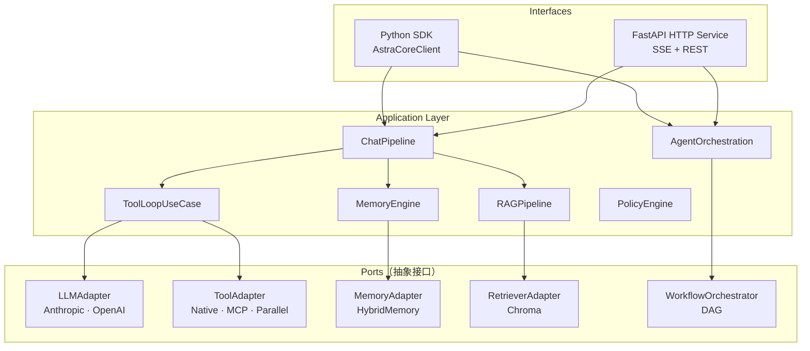
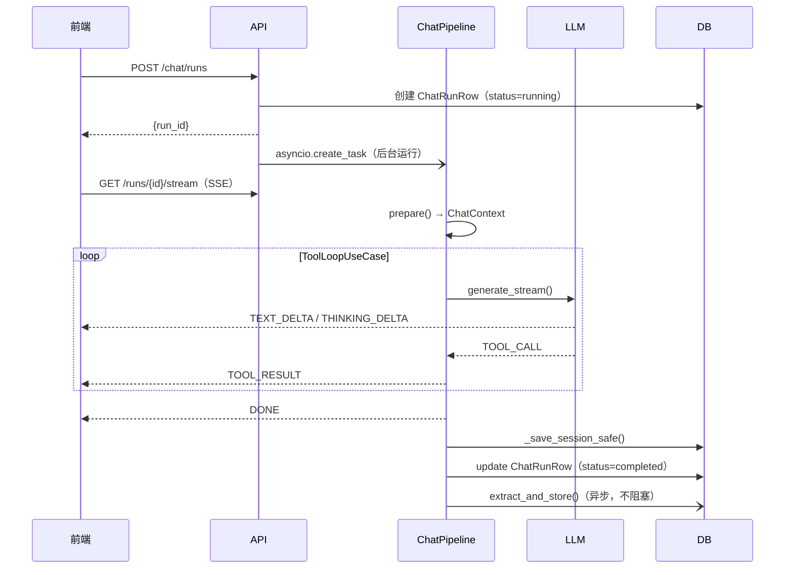

# AstraCoreAI 设计文档

> 本文档是 AstraCoreAI 的架构契约文件，描述系统分层结构、关键模块设计与设计原则。
> 实现必须以本文档为准；新增能力优先通过 Ports 扩展，不得绕过应用层直接耦合基础设施。

---

## 1. 背景与目标

AstraCoreAI 是一套面向复用的 Python AI 应用框架，采用 **Clean Architecture + 自研轻内核** 路线：

- 统一 AI 能力（对话、工具、记忆、RAG、多 Agent、Skill）以可复用接口暴露
- 保持核心稳定，避免被具体 Provider（Anthropic / OpenAI）或编排框架绑定
- 同时提供 **SDK 形态**（脚本/集成）与 **HTTP Service 形态**（FastAPI）
- 默认最小依赖：SQLite + 本地向量库；Redis / PostgreSQL 作为可选扩展

---

## 2. 设计原则

| 原则 | 含义 |
|------|------|
| **框架先于业务** | 所有能力以可复用接口暴露，业务仅做配置与扩展 |
| **端口优先** | 先定义协议边界，再接入实现；实现可随时替换 |
| **prepare / stream 分离** | `prepare()` 完成所有 I/O 决策并冻结，`stream()` 是纯执行 |
| **策略集中治理** | 预算、超时、重试、熔断统一进入 PolicyEngine |
| **双形态一致** | SDK 与 HTTP Service 共享同一 `ChatPipeline` 执行引擎 |
| **可演进编排** | 默认 NativeOrchestrator，后续可插 LangGraph Orchestrator |

---

## 3. 总体架构


```mermaid
flowchart TD
    subgraph 接口层["Interfaces"]
        SDK["Python SDK
AstraCoreClient"]
        HTTP["FastAPI HTTP Service
SSE + REST"]
    end

    subgraph 应用层["Application Layer"]
        CP["ChatPipeline"]
        TL["ToolLoopUseCase"]
        ME["MemoryEngine"]
        RP["RAGPipeline"]
        AO["AgentOrchestration"]
        PE["PolicyEngine"]
    end

    subgraph 端口层["Ports（抽象接口）"]
        LLMPort["LLMAdapter
Anthropic · OpenAI"]
        ToolPort["ToolAdapter
Native · MCP · Parallel"]
        MemPort["MemoryAdapter
HybridMemory"]
        RetPort["RetrieverAdapter
Chroma"]
        WFPort["WorkflowOrchestrator
DAG"]
    end

    SDK & HTTP --> CP & AO
    CP --> TL & ME & RP
    TL --> LLMPort & ToolPort
    ME --> MemPort
    RP --> RetPort
    AO --> WFPort
```

---

## 4. 分层与职责

### 4.1 Domain 层

纯领域模型，不依赖任何外部框架：

- **消息模型**：`Message`、`MessageRole`（USER / ASSISTANT / SYSTEM / TOOL）、`ToolCall`、`ToolResult`
- **会话模型**：`SessionState`、`ContextWindow`
- **检索模型**：`RetrievalQuery`、`RetrievedChunk`、`Citation`
- **Agent 模型**：`AgentTask`（含 `depends_on`、`condition`）、`WorkflowState`
- **记忆模型**：`Memory`、`MemoryScope`（SESSION / PROJECT / USER / GLOBAL）、`MemoryType`
- **上下文模型**：`ChatContext`（不可变冻结数据类，由 `prepare()` 生成）

### 4.2 Application 层

业务用例编排层，是系统核心行为所在：

**ChatPipeline** (`modules/chat/pipeline.py`)
- `prepare()` — 一次性批量完成所有 DB 查询和决策，返回不可变 `ChatContext`
- `stream(ctx)` — 纯执行，消费 `ChatContext`，不再访问数据库
- 内部组装四层 System Prompt 和消息栈，路由到工具循环

**ToolLoopUseCase** (`modules/chat/application/tool_loop.py`)
- 实现最多 N 轮的工具调用循环
- 每轮并行执行工具，收集结果追加给 LLM
- 收尾轮确保最终输出是文本（非悬空工具调用）

**MemoryEngine** (`modules/memory/application/engine.py`)
- `build_profile_context()` — 加载 USER/GLOBAL 范围记忆 → 注入 System Prompt（Tier-1）
- `build_turn_context()` — 向量召回 SESSION/PROJECT 范围记忆 → 注入消息栈（Tier-2）
- `extract_and_store()` — 对话后异步提取结构化记忆，压缩 + 晋升

**RAGPipeline** (`modules/rag/application/pipeline.py`)
- 检索 → 重排 → 引用注入，结果附带来源信息

**AgentOrchestrationUseCase** (`modules/agent/application/orchestration.py`)
- 基于 Kahn 拓扑排序的 DAG 工作流，同层任务 `asyncio.gather` 并行执行
- 支持条件跳过（`AgentTask.condition` 在受限命名空间求值）

### 4.3 Ports 层

可替换边界，保证实现可插拔：

- `LLMAdapter` — 流式生成、token 计数、结构化输出
- `ToolAdapter` — 工具注册与执行（Native / MCP / ParallelAgent）
- `MemoryAdapter` — 短期记忆的读写（HybridMemory 实现：Redis + SQLite）
- `MemoryStore` — 结构化长期记忆的 CRUD
- `RetrieverAdapter` — 向量检索接口（Chroma 实现）
- `WorkflowOrchestrator` — DAG 工作流编排接口
- `AuditLogger` / `MetricsReporter` — 可观测性接口

### 4.4 Infrastructure 层

对外部依赖的具体实现：

- **LLM**：`AnthropicAdapter`（含 Extended Thinking、content block 重放）、`OpenAIAdapter`
- **存储**：`HybridMemoryAdapter`（Redis 热路径 + SQLite 持久化）、`SQLMemoryStore`
- **向量**：ChromaDB（支持语义搜索降级到 SQL 排序）
- **工具**：`NativeToolAdapter`、`MCPToolAdapter`、`ParallelAgentTool`
- **工作流**：`NativeWorkflowOrchestrator`（Kahn DAG + asyncio.gather）
- **应用**：FastAPI 工厂、SSE 广播、中间件

### 4.5 Interfaces 层

**SDK**（`sdk/client.py`）：
- `AstraCoreClient` — 异步上下文管理器，管理 MCP 生命周期
- `Conversation` — 多轮对话门面，自动管理 session_id 与历史
- `WorkflowClient` — DAG 工作流执行入口

**HTTP Service**（`app/`）：
- `POST /api/v1/chat/runs` — 创建后台生成任务，立即返回 `run_id`
- `GET /api/v1/chat/runs/{run_id}/stream` — SSE 订阅事件流
- `GET /api/v1/chat/sessions/{session_id}/runs/active` — 重连时查找运行中 run

两者共享同一 `ChatPipeline`，功能完全一致，无重复逻辑。

---

## 5. 关键设计详解

### 5.1 ChatPipeline：prepare / stream 分离

```
prepare(user_msg, options)
  ├─ _build_system_prompt()     # 四层叠加：身份 + Skill清单 + Tier-1记忆 + RAG
  ├─ _build_turn_context()      # Tier-2：向量召回 session/project 记忆
  ├─ 解析温度 / 上下文窗口 / 工具白名单
  └─ return ChatContext（frozen dataclass）

stream(ctx)
  ├─ 加载历史消息（短期记忆）
  ├─ 组装消息栈：[system, history, tier2-pair, skill-reminder, user-msg]
  └─ _stream_tool_loop() / _stream_normal()
```

**核心约束**：`stream()` 不访问数据库，`prepare()` 不生成任何流式输出。

### 5.2 工具循环

- 始终开启（`mode = "tool_loop"`），统一 Agent 与普通对话的执行路径
- 每轮：LLM 生成 → 并行执行工具 → 追加结果 → 下一轮
- 收尾轮：末尾为工具结果时，注入禁止继续调用工具的指令，强制 LLM 返回文本
- 并行 Agent：`spawn_agents` 工具将任务拆分，每个 Worker 独立执行（最多 5 轮）

### 5.3 System Prompt 组装

| 层次 | 内容 | 注入时机 |
|------|------|---------|
| 注入安全声明 | `<external_data>` 标签说明，禁止将外部数据视为指令 | 每次请求，最顶部 |
| 身份层 | AI 名称、主人、时间、全局指令 | 每次请求 |
| Skill 摘要清单 | 所有 Skill 的 name + description | 每次请求 |
| HITL 使用指南 | `ask_user` 工具使用场景说明（hitl.enabled 时注入） | 按配置 |
| Tier-1 记忆 | USER + GLOBAL 范围的长期记忆 | 每次请求 |
| RAG 召回 | 知识库检索结果（可关闭） | 按需 |

各层以 `"

---

"` 分隔，合并为单一 system 字段。

### 5.4 记忆系统

**注入方式**：
- Tier-1（USER/GLOBAL）→ System Prompt，稳定，不受上下文截断影响
- Tier-2（SESSION/PROJECT）→ 合成消息对，每轮重新向量召回，不写入持久化历史

**提取与晋升**（对话结束后异步执行）：
1. LLM 识别可存储事实（`_ExtractionBatch` schema）
2. 去重/合并（同 subject + 相似 content）
3. SESSION 记忆超过 12 条 → 压缩为摘要
4. 启发式 + LLM 决策晋升：`promote_user / promote_project / keep / archive`

### 5.5 Skill 系统

Skill 是 Claude 按需加载的专业能力包，遵循 [Agent Skills 开放标准](https://agentskills.io)。

**三个工具**（NativeToolAdapter 注册）：

| 工具 | 功能 |
|------|------|
| `load_skill(skill_id)` | 加载完整 instructions + 引用列表 + 脚本列表 |
| `get_skill_reference(skill_id, file)` | 读取 references/ 下的参考文档 |
| `run_skill_script(skill_id, script, args)` | 执行 scripts/ 下的脚本（30s 超时，防路径穿越） |

**续接机制**：检测到活跃 Skill 后，向消息栈注入合成的续接提醒，确保多轮对话中 Claude 不遗忘当前技能规范。

### 5.6 LLM Profile 注册表

- `config/config.yaml` 定义 `llm.profiles`，每个 profile 含 `id`、`model`、`protocol`、`base_url`、可选 `capabilities` 覆盖
- 业务代码使用 `profile_id`（如 `"claude-sonnet"`），不直接暴露上游模型名
- `model_capabilities.py` 按 protocol + model + base_url 内置推导能力（tools、thinking、temperature）
- LLMAdapter 按 profile_id 缓存实例

### 5.7 后台 Run + SSE 订阅

一次对话请求拆分为两个独立 HTTP 请求：

```
POST /chat/runs        → 创建后台 asyncio Task，立即返回 run_id
GET  /runs/{id}/stream → SSE 订阅，浏览器断开不取消后台任务
```

**内存热状态**：运行中的 run 以 `_ActiveRun` 保存在进程字典中，SSE 重连时优先返回内存快照。
**完成落库**：任务完成后一次性写入 `ChatRunRow` + 消息持久化。
**已知限制**：进程内 `_ACTIVE_RUNS` 字典在多 worker 部署时不共享，生产水平扩展需迁移到 Redis。

### 5.8 Hook / Callback 系统

`HookRegistry` 提供四个切入点，支持 async/sync 混用，每个 Hook 异常独立捕获：

| Hook | 触发时机 | 可修改内容 |
|------|---------|-----------|
| `before_llm` | LLM 调用前 | 修改 messages、tools、kwargs |
| `after_llm`  | LLM 完成后 | 修改输出内容、元数据 |
| `before_tool` | 工具执行前 | 修改参数（返回值影响实际执行）|
| `after_tool`  | 工具完成后 | 修改结果、添加元数据 |

接入：`ChatPipeline(hooks=registry)` 或 `AstraCoreClient(hooks=registry)`。

### 5.9 链路追踪（Tracer）

`Tracer` 通过 `register_hooks(registry)` 无侵入注入自身：
- LLM Span：`before_llm` 开启，`after_llm` 关闭
- Tool Span：`before_tool` 开启，`parent_span_id` 指向当前 LLM Span
- 输出：结构化 JSON 日志（`_logger.debug("SPAN %s", ...)`），零外部依赖

### 5.10 DAG 工作流引擎

`NativeWorkflowOrchestrator` 基于 Kahn 拓扑排序实现真正的并行工作流：

```
_topo_layers(tasks)                   # Kahn 算法，按依赖层分组
for layer in layers:
    asyncio.gather(*[_run_task(t) for t in layer])  # 同层并行
        condition_eval() → SKIPPED / executor(task, task_results)
```

- `AgentTask.depends_on` — 前序依赖列表
- `AgentTask.condition` — Python 表达式，受限命名空间求值（无 builtins）
- 任意任务失败 → 工作流立即标记 FAILED，跳过剩余层

### 5.11 PolicyEngine

统一治理以下策略，避免散落在各适配器中：

- **重试策略**：基于 tenancy，指数退避，对 429/5xx 生效
- **超时控制**：asyncio.timeout，可按 profile 配置
- **熔断器**：三态状态机（CLOSED → OPEN → HALF_OPEN），集成在 PolicyEngine
- **Token 预算**：输入/输出 token 上限配置
- **工具白名单**：`allowed_tools` frozenset，在 `prepare()` 确定

---

## 6. 数据流（核心对话路径）


```mermaid
sequenceDiagram
    participant 前端
    participant API
    participant Pipeline as ChatPipeline
    participant LLM
    participant DB

    前端->>API: POST /chat/runs
    API->>DB: 创建 ChatRunRow（status=running）
    API-->>前端: {run_id}
    API-)Pipeline: asyncio.create_task（后台运行）

    前端->>API: GET /runs/{id}/stream（SSE）

    Pipeline->>Pipeline: prepare() → ChatContext
    loop ToolLoopUseCase
        Pipeline->>LLM: generate_stream()
        LLM-->>前端: TEXT_DELTA / THINKING_DELTA
        LLM-->>Pipeline: TOOL_CALL
        Pipeline-->>前端: TOOL_RESULT
    end
    Pipeline-->>前端: DONE

    Pipeline->>DB: _save_session_safe()
    Pipeline->>DB: update ChatRunRow（status=completed）
    Pipeline-)DB: extract_and_store()（异步，不阻塞）
```

---

## 7. 配置模型

`config/config.yaml` 统一管理结构化配置，`.env` 仅存密钥。

| 配置节 | 关键字段 |
|--------|---------|
| `llm` | `default_profile`, `profiles[]`（id/model/protocol/capabilities） |
| `agent` | `max_iterations`, `tool_timeout`, `enable_spawn_agents` |
| `memory` | Redis/SQLite 连接，`retention_days` |
| `retrieval` | `enabled`, ChromaDB `collection_name`, `persist_directory` |
| `mcp` | `servers[]`（filesystem / shell / 自定义） |
| `skills` | `extra_dirs`（额外 Skill 目录，`~/xxx` 支持） |

---

## 8. 与 LangGraph 的兼容策略

- `WorkflowOrchestrator` Port 作为唯一编排抽象入口
- 默认实现：`NativeWorkflowOrchestrator`（Kahn DAG + asyncio）
- 后续新增：`LangGraphOrchestrator`，仅在 infrastructure 层做状态映射
- Domain 与 Application 层不依赖 LangGraph 类型，切换通过配置实现

---

## 9. 错误处理与可靠性

| 场景 | 处理方式 |
|------|---------|
| Provider 429/5xx | 指数退避重试（PolicyEngine + tenacity） |
| 工具执行失败 | 最大重试次数 + 熔断阈值，超限返回错误结果给 LLM |
| 流式场景异常 | 发出 ERROR 类型 SSE 事件，避免前端无限等待 |
| 浏览器断开 | SSE 订阅断开，后台 Task 继续执行，重连后恢复 |
| 孤儿工具结果 | 上下文截断后过滤无对应 tool_use 的 tool_result |
| 进程重启 | 运行中 run 中断（in-process），后续可迁移为独立队列 |

---

## 10. 测试策略

- **单元测试**：Domain 规则、PolicyEngine、预算与裁剪算法（pytest, 190 passing）
- **合约测试**：各 Adapter 对 Ports 契约的兼容性
- **集成测试**：Chat + Tool + Memory + RAG 端到端链路
- **Agent 评估**：`astracore.eval` 框架（EvalRunner + LLM-as-judge + 工具精确匹配 + CLI）
- **质量门**：`make check`（ruff + mypy）必须在每次提交前通过

---

## 11. 里程碑状态

| 里程碑 | 内容 | 状态 |
|--------|------|------|
| M1 | 核心协议、Provider 适配、工具最小闭环 | ✅ |
| M2 | 记忆、预算、PolicyEngine、可观测基础 | ✅ |
| M3 | RAG 与引用体系，评估基线 | ✅ |
| M4 | 多 Agent 协作、并行 spawn_agents | ✅ |
| M5 | SDK 全功能、ChatPipeline 统一引擎、Skill 系统、MCP | ✅ |
| M5+ | Hook 系统、Span 追踪、DAG 工作流、熔断器、Structured Output、Agent Eval、Skill 重设计 | ✅ |
| M6 | 可靠性与安全：熔断完善、API Key 鉴权、限流 | 🔲 |
| M7 | 可观测与性能：SLO/指标/压测基线 | 🔲 |
| M8 | 发布工程化：版本策略、回滚预案、运维文档 | 🔲 |

---

## 12. 目录结构

```
src/astracore/
├── modules/           # 业务能力（Clean Architecture 按模块组织）
│   ├── chat/          # Pipeline、工具循环、Session、Conversation CRUD
│   ├── memory/        # MemoryEngine：提取、注入、Tier-1/Tier-2
│   ├── rag/           # RAG：召回 → 重排 → 引用
│   ├── skills/        # Skill CRUD、SKILL.md 加载、三个 Skill 工具
│   ├── tools/         # 内置工具注册（builtin.py）
│   ├── agent/         # 多 Agent DAG 工作流
│   ├── auth/          # JWT 鉴权：register/login/me，bcrypt + jose，admin/user 角色
│   ├── users/         # 用户 CRUD（管理员操作）
│   ├── projects/      # Project CRUD 与对话绑定
│   ├── settings/      # 用户设置（ai_name、owner_name、global_instruction）
│   └── system/        # 健康检查 / 系统信息
├── infrastructure/    # 外部依赖适配（不被 modules 直接 import）
│   ├── llm/           # AnthropicAdapter、OpenAIAdapter
│   ├── memory/        # HybridMemoryAdapter、SQLMemoryStore、ChromaVector
│   ├── tools/         # NativeToolAdapter、MCPToolAdapter、ParallelAgentTool
│   ├── retrieval/     # ChromaDB 向量检索实现
│   ├── tokenizer/     # Token 计数工具
│   └── workflow/      # NativeWorkflowOrchestrator
├── shared/            # 横切关注点
│   ├── ports/         # LLMAdapter、ToolAdapter、MemoryAdapter（抽象接口）
│   ├── policy/        # PolicyEngine（tenacity 重试 + asyncio 超时 + 熔断）
│   ├── observability/ # HookRegistry、Tracer、Logger
│   └── security/      # SecurityValidator、wrap_external
├── app/               # FastAPI 工厂、路由、SSE 端点
└── sdk/               # AstraCoreClient、WorkflowClient、公开 API 面
```
